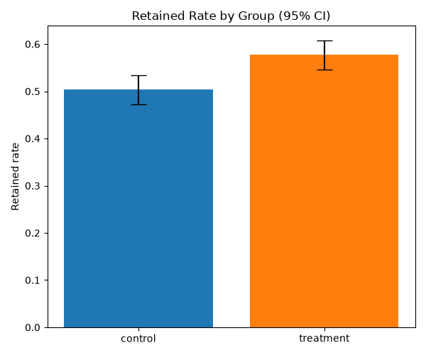
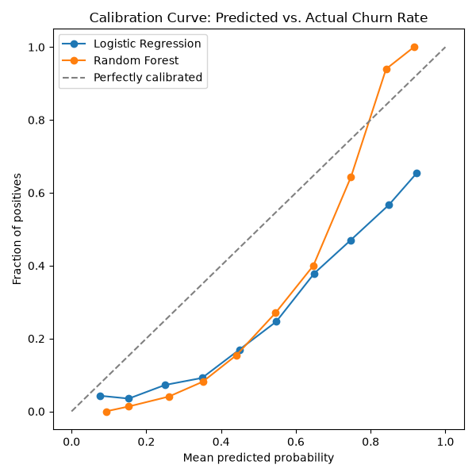

# Bank Customer Churn Prediction & Retention Experiment

An end-to-end project combining a **churn propensity model** with a simulated
**A/B test** of a retention intervention, built to mirror a real Business
Analytics / Data Science workflow: predict risk, design an experiment,
measure impact with appropriate statistical rigor.

## Highlights!
- Built an interpretable churn propensity model (Logistic Regression) on **10,000** bank customers, reaching **0.775 ROC AUC**, benchmarked against a Random Forest (0.859 AUC) to evaluate the interpretability-vs-lift trade-off.
- Identified Age, Geography (Germany), and Tenure as top churn drivers via odds ratios (1.92x, 1.42x, 1.42x), and flagged the top 20% highest-risk customers (threshold 0.645, n=2,000) for targeting.
- Ran a pre-test power analysis sizing a retention experiment for a 7pp minimum detectable effect (required n=777/group); executed on a correctly-powered sample of ~1,000/group.
- Designed and analyzed a randomized A/B test of a retention offer via two-proportion z-test, finding a **7.4**pp retention lift (**95% CI 3.0–11.8%, p=0.0009**) with no guardrail breach on complaint rate (p=0.50).

## Pipeline
1. **Data prep** - load and clean the bank churn dataset (10K customers),
   engineer behavioural features (balance-to-salary ratio, product density).
2. **Churn modeling** - Logistic Regression (primary, interpretable model)
   benchmarked against Random Forest; evaluated on ROC AUC, calibration,
   and feature importance/odds ratios rather than accuracy alone.
3. **A/B test design** - identify the top **20%** highest-risk customers,
   compute the required sample size for a target minimum detectable effect
   BEFORE randomizing, then simulate a retention offer intervention.
   *(Note: outcomes are simulated, not real observed results. The real
   dataset has no experiment recorded. This demonstrates experiment design
   and analysis methodology.)*
4. **Experiment analysis** - two-proportion z-test, 95% confidence
   intervals on the treatment effect, a guardrail metric check (complaint
   rate), and an explicit discussion of limitations (peeking, novelty
   effects, randomization design).

## Outputs:

1. **Retained Rate by Group**



2. **Calibration Curve**



## Project Structure

```bash
Bank-Churn-Retention-Experiment
│── data/                              # raw dataset downloaded from url 
|── src/                               # data preparation, churn modeling, experienments, a/b tests
│── main.py/                           # main python file- joins all the data, src, output files
│── outputs                            # charts and processed csv files   
```

## Why this project
Designed to demonstrate the full loop a Data Scientist in a commercial
Business Analytics team is expected to run: risk/propensity modeling →
experiment design → statistically rigorous measurement → business
recommendation.

## Run it using the following commands
- git clone https://github.com/bluvitriol/Banking-Churn-Retention-Experiment
- pip install -r requirements.txt
- python main.py

## Limitations and Caveats:
- This experiment used simulated outcomes layered on real customer attributes; real deployment would need actual observed retention data.
- Randomization was simple 50/50 - in production, consider stratifying by churn-risk decile to balance groups more tightly.
- A single short look at results risks the 'peeking problem' - this analysis assumes a single, pre-planned endpoint check.
- Short-term effects: a retention offer may show an inflated short-term effect that fades - a longer observation window is recommended before declaring success.

## (Optional) Next Steps
Research another dataset of your own choice which contains similar data and columns and run it using either:
- new dataset url which can be pasted in ```RAW_URL``` variable in ```src\data_prep.py```
- new CSV file